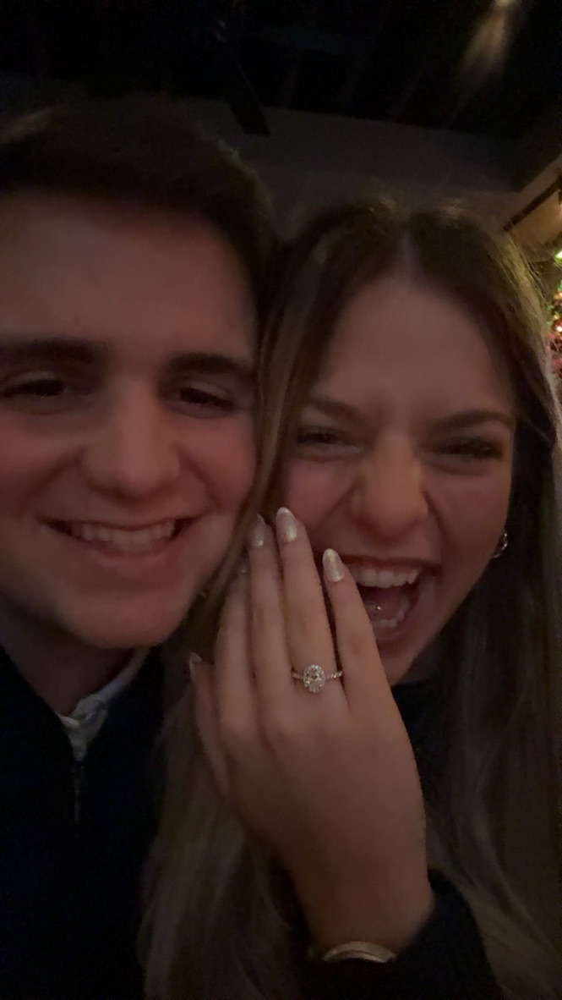

::: {.hero}
::: {.hero-copy}
[CYBER SCIENCE / WEST POINT]{.eyebrow}

# Trevor Patton.

## Curiosity in the digital world. Discipline in everything else.

I’m a senior studying Cyber Science at the United States Military Academy, with an expected graduation in June 2027. I'm interested in how networks work, how they can be secured, and what hands-on exploration can teach us.

::: {.hero-actions}
[Get to know me](about.qmd){.button-primary}
[Explore my interests ↓](#interests){.button-secondary}
:::

[Weight lifter. Grappler. God fearer.]{.personal-line}
:::
::: {.hero-portrait}
{.portrait}
[BEYOND THE SCREEN]{.photo-label}
:::
:::

::: {.section-heading}
[01 / FOCUS]{.eyebrow}

## Learning by doing. {#interests}

The areas that keep me curious—and keep me coming back to learn more.
:::

::: {.focus-grid}
::: {.focus-card}
[01]{.card-number}

### Network operations

Understanding the systems that connect us, from the fundamentals of networking to the challenges of operating and defending them.
:::
::: {.focus-card}
[02]{.card-number}

### Offensive security

Exploring ethical hacking and offensive cyber operations to better understand weaknesses and how to address them.
:::
::: {.focus-card}
[03]{.card-number}

### Hands-on practice

Building my skills through TryHackMe and personal projects, connecting classroom concepts with practical experience.

[My TryHackMe profile ↗](https://tryhackme.com/p/trevordpatton)
:::
:::

::: {.learning-panel}
::: {}
[02 / IN PROGRESS]{.eyebrow}

## Projects, with room to grow.

I’m building my foundation in cyber security. This space will grow into a collection of projects and the lessons behind them.
:::
[Find me on GitHub ↗](https://github.com/t-patton93){.button-secondary}
:::

::: {.section-heading}
[03 / NOTES & DISCOVERIES]{.eyebrow}

## A notebook for the journey.

A future home for reflections on cyber, reading notes, and useful things I discover along the way.
:::

::: {.focus-grid}
::: {.focus-card}
### Cyber notes

Learning, experiments, and ideas worth revisiting. First entries to come.
:::
::: {.focus-card}
### On my bookshelf

A place for books and the ideas that stay with me. Reading list to come.
:::
::: {.focus-card}
### Useful finds

Tools and resources I want to keep close at hand. Collection to come.
:::
:::

::: {.closing}
[04 / OUTSIDE OF CYBER]{.eyebrow}

## More than what happens on a screen.

Weightlifting, grappling, and faith are part of who I am. This is a space for both my professional interests and the person behind them.

[More about me →](about.qmd)
:::
